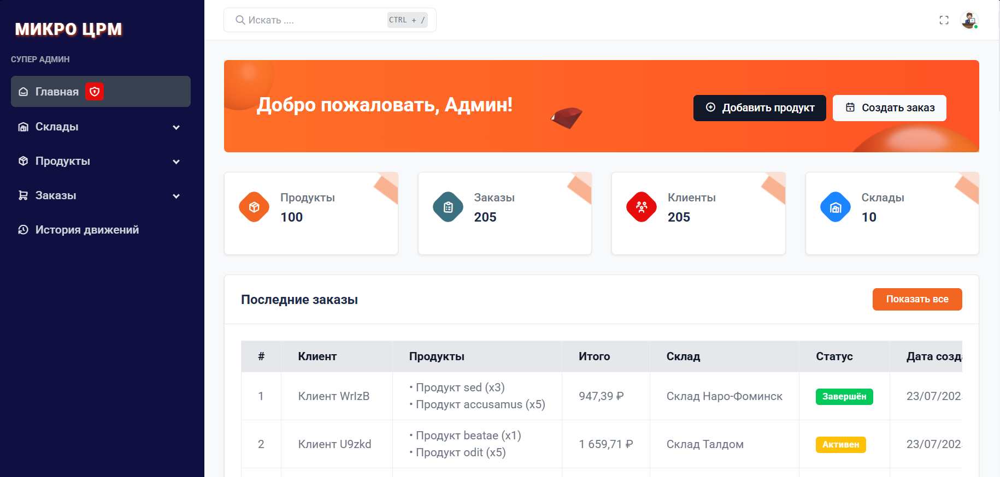
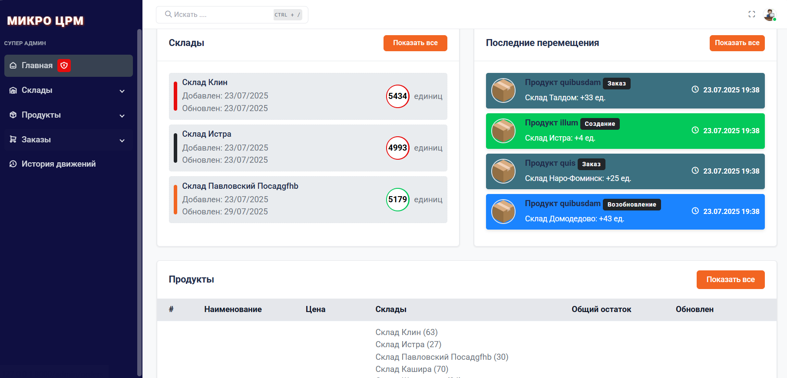
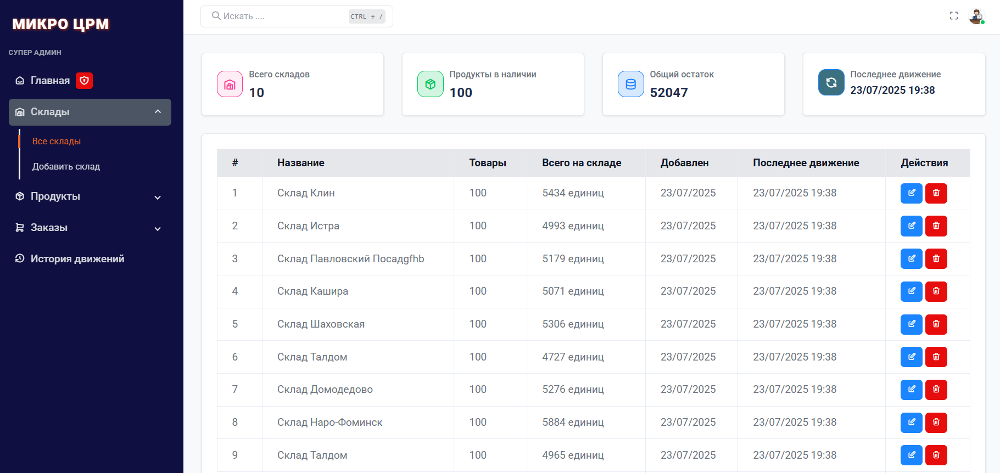
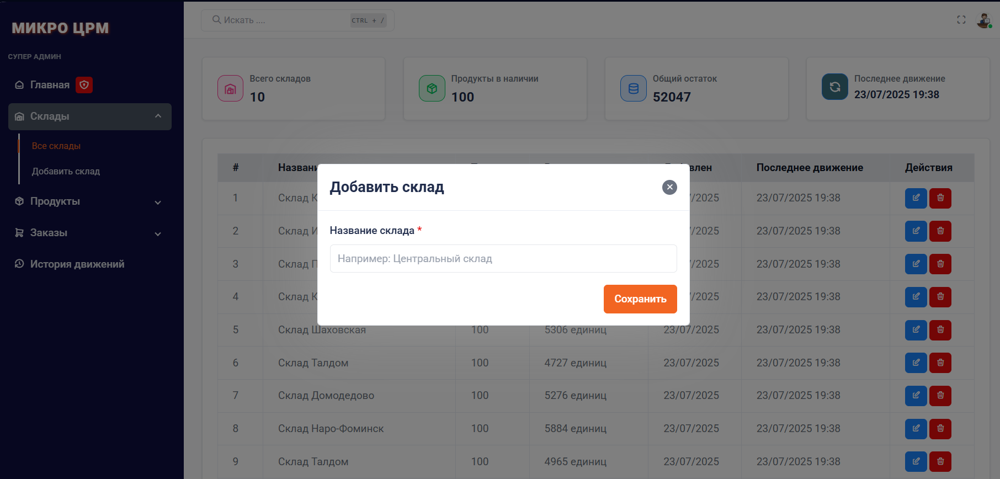
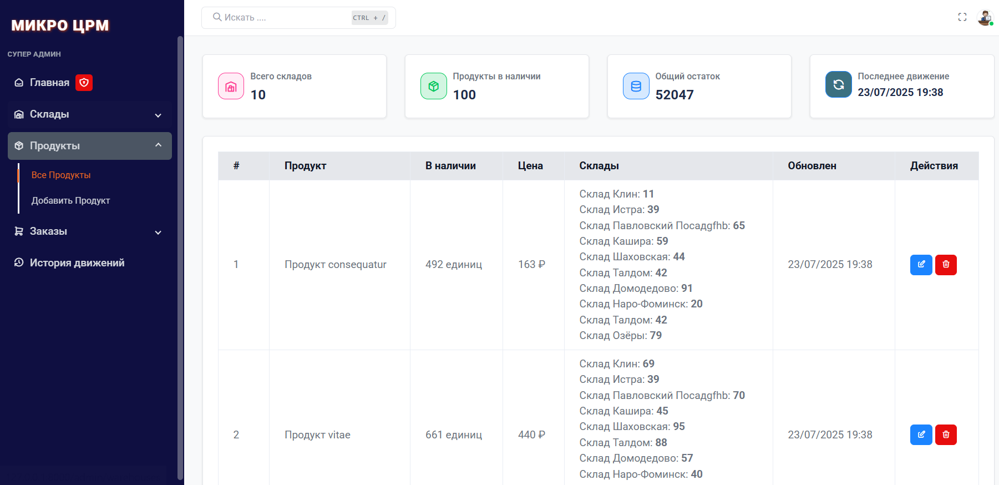
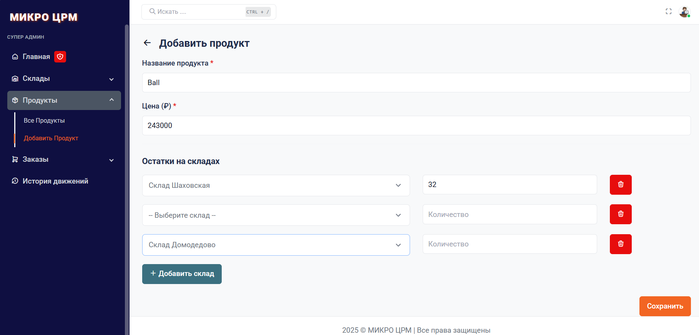
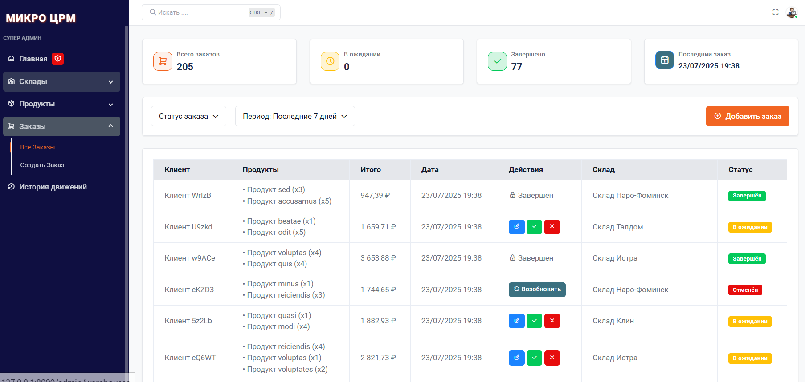
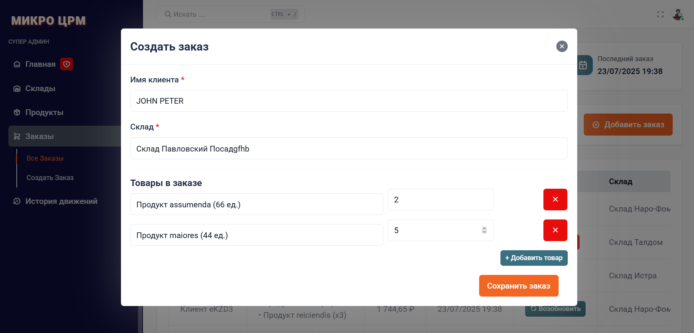
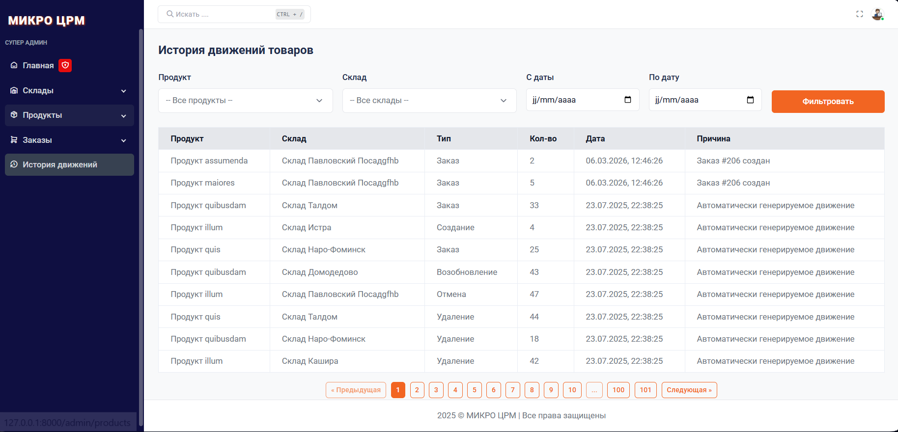

# Micro CRM — Product and Order Management System

This project was developed as part of a **technical test**.  
It is a system for managing products, warehouses, orders, and stock movements, built with Laravel.

---

## Screenshots

| Dashboard | Dashboard 2 | Warehouses |
|-----------|-------------|------------|
|  |  |  |

| Add Warehouse | Products | Add Product |
|---------------|---------|------------|
|  |  |  |

| Orders | Add Order | Movement History |
|--------|-----------|-----------------|
|  |  |  |

> Screenshots show the main pages: dashboard, CRUD operations, orders, and stock movement history.

---


## Technologies Used

- PHP 8.3.17
- Laravel 12.2
- MySQL
- Bootstrap 5
- Blade
- REST API
- Artisan commands

---

## Features

### Part 1: Basic Management
- CRUD operations for products
- CRUD operations for warehouses
- Stock management by warehouse
- Create, update, cancel, and complete orders
- Automatic stock updates

### Part 2: Movement History
- `movements` table tracks all stock changes
- Records every movement: creation, update, order, cancellation, etc.
- Web interface with filters by warehouse, product, and date
- REST API endpoint `/api/movements` supports filtering and pagination

### Part 3: Test Data

- You can generate test data using the following Artisan command:

```bash
php artisan seed:test-data 
```

Will automatically create:

- 10 warehouses  
- 50 products  
- Over 1000 stock records  
- Product movement history


## API Endpoint

**GET** `/api/movements`

Allows fetching a list of product movements with support for filters and pagination.

### Request Parameters:

- `product_id` — Product ID (optional)
- `warehouse_id` — Warehouse ID (optional)
- `from` — Start date (format YYYY-MM-DD)
- `to` — End date (format YYYY-MM-DD)
- `per_page` — Number of records per page (default 15)

### Example Request:

```http
GET /api/movements?product_id=5&warehouse_id=2&from=2024-01-01&to=2024-12-31&per_page=5
```

# Project Setup

```bash
git clone https://github.com/hallame/microcrm.git
```
```bash
cd microcrm
```
```bash
cp .env.example .env
```
```bash
composer install
```
```bash
php artisan key:generate
```
```bash
php artisan migrate
```
```bash
php artisan migrate:fresh --seed
```
```bash
php artisan serve
```


## Author
**Hormise ALLAME**
- Full Stack Developer
- Telegram: @hormise
- Website: [OMIZIX.COM](https://omizix.com)
